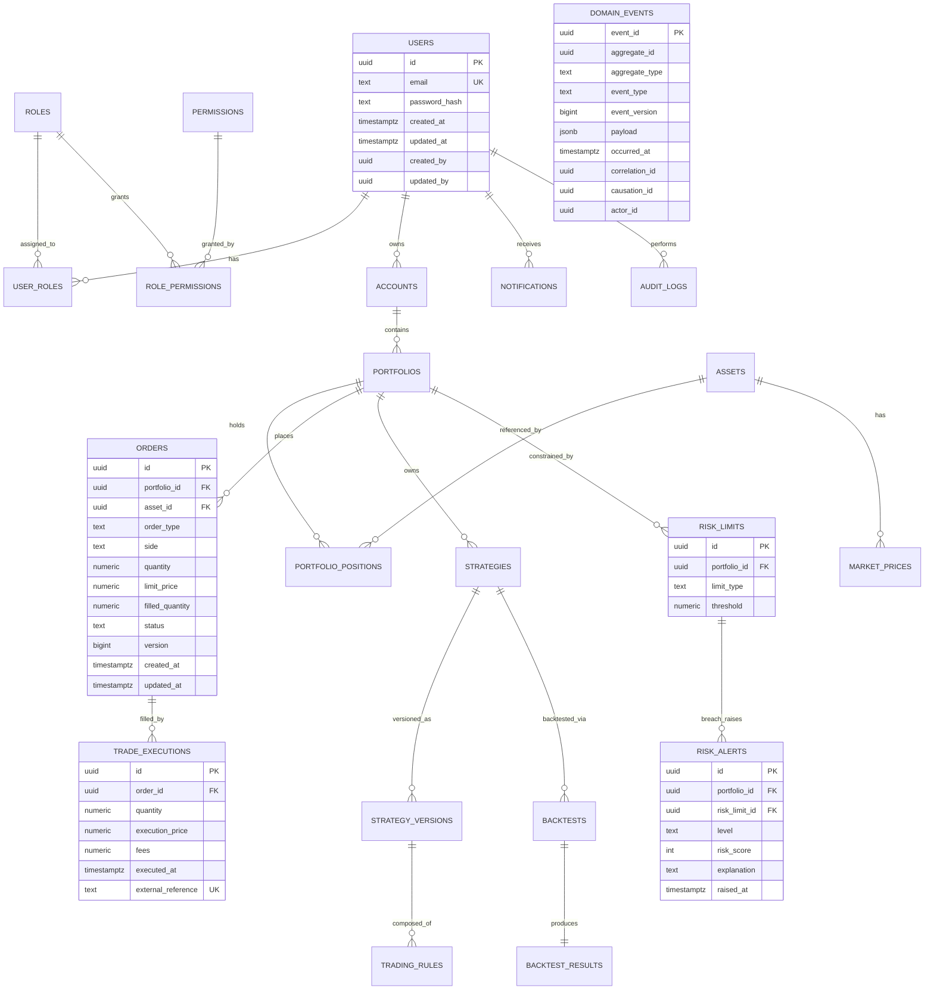

# MyWallet - Relational Schema (reference)

This is the design-time reference schema. The authoritative, versioned source of truth
once Phase 2 starts will be the Flyway migrations under
`backend/src/main/resources/db/migration/`.

## Key design notes

- **`domain_events` is append-only and is never deleted, ever** - this is a hard rule from
  the project brief ("ne jamais supprimer les événements d'audit"). No `DELETE` grant on
  this table for any application role, enforced both at the ORM level and via a Postgres
  `REVOKE`.
- **Index plan:** `(aggregate_id, event_version)` unique composite index on `domain_events`
  - this is the index the replay query in `sequence-event-replay.md` relies on. A secondary
  index on `(occurred_at)` supports the point-in-time reconstruction query
  (`occurred_at <= :at`).
- **`orders.version`** is the JPA `@Version` optimistic-lock column - separate from
  `domain_events.event_version`, which is per-event. `orders.filled_quantity` and
  `orders.status` are **denormalized read projections** derived from events; the source of
  truth remains `domain_events`. This is documented explicitly so nobody "fixes" the
  projection table directly during a hotfix and silently diverges from the event log.
- **`trade_executions.external_reference`** carries a unique constraint - this is the
  idempotency key used by `sequence-partial-execution.md` to reject duplicate execution
  events from the simulated feed.
