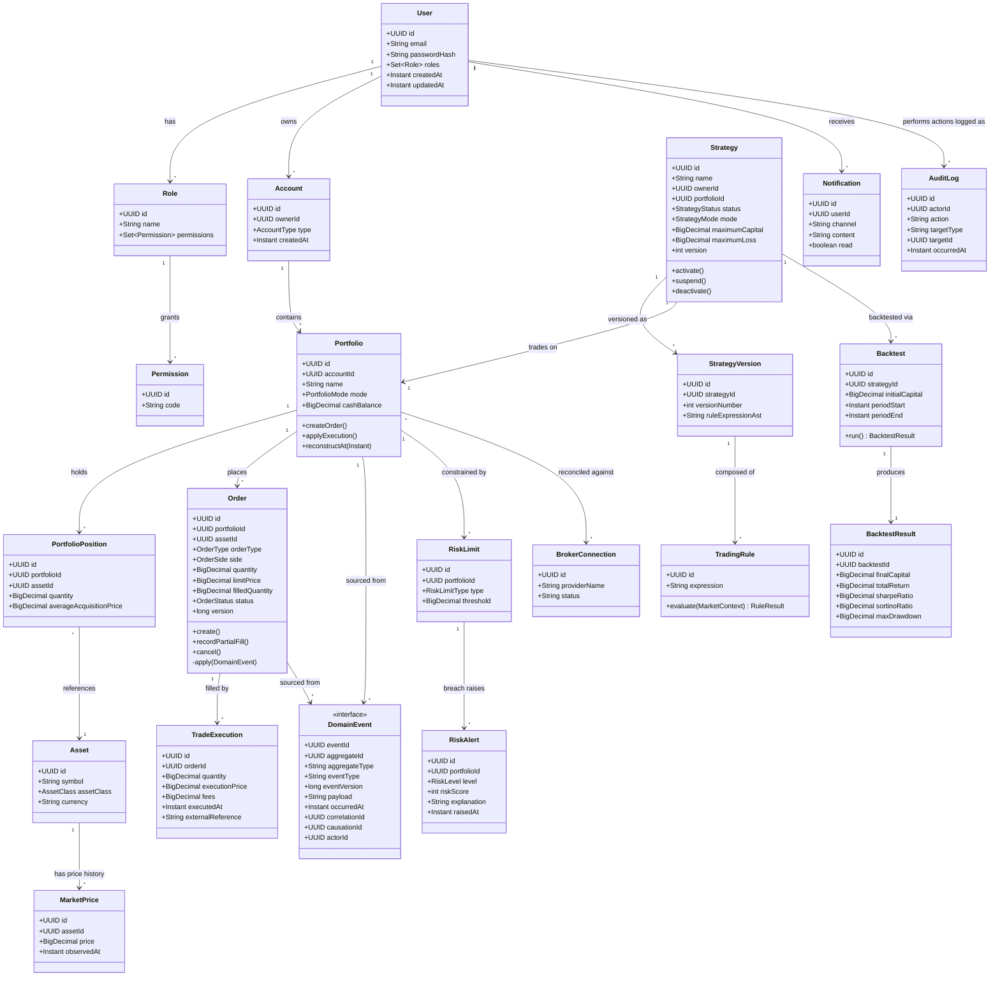

# MyWallet - Domain Model

This diagram covers the core aggregates and their relationships. Value objects and pure
lookup entities (Role, Permission) are simplified for readability - see the relational
schema (`db-schema.md`) for full column-level detail.

## Notes on the design

- **Order and Portfolio are the two event-sourced aggregates.** Their current state is
  never stored as a plain column set - it is always derived by replaying `DomainEvent`
  rows filtered by `aggregateId`. See `sequence-order-creation.md` and
  `sequence-event-replay.md`.
- **Strategy is versioned explicitly** (`StrategyVersion`) rather than event-sourced, since
  its lifecycle (draft -> active -> suspended -> deactivated) is simpler and doesn't need full
  replay - a normal optimistic-locking `version` column is sufficient.
- **RiskLimit / RiskAlert** are deliberately modeled as first-class domain objects (not just
  configuration), because a `RiskLimitBreached` event needs to reference *which* limit was
  breached, by how much, for the alert's explanation to be meaningful
  ("Exposure to BTCUSDT is 42%, configured limit is 25%").
