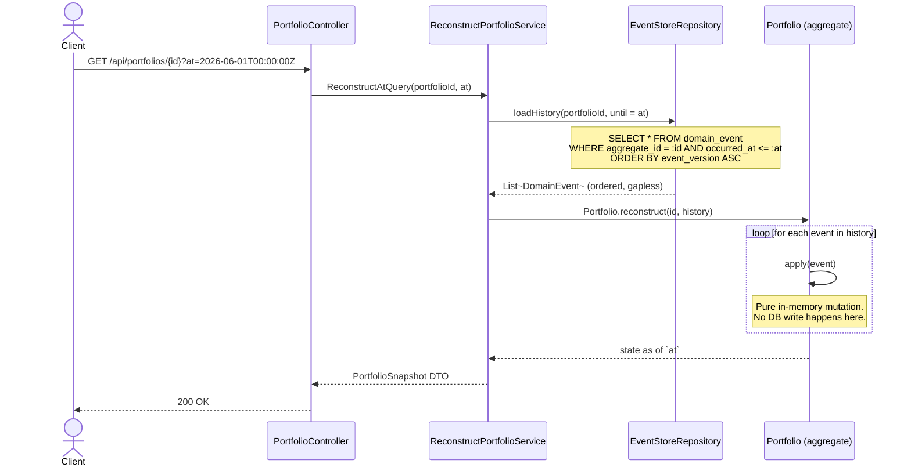

# Sequence - Event Replay & Point-in-Time Reconstruction

Two use cases share the same mechanism: reconstructing an aggregate's *current* state
(used on every command), and reconstructing a Portfolio's state *as of a past date*
(used by `GET /api/portfolios/{id}/performance?at=...`).

## Notes

- Replaying from event #1 every time does not scale indefinitely; if a spike test
  (see `plan-project` -> Technical Spikes) shows replay latency becoming a problem, the
  mitigation is **snapshotting**: periodically persist `(aggregateId, version, stateBlob)`
  and replay only the events *after* the last snapshot.
- The same mechanism powers the **Mode Replay** UI feature: instead of jumping straight to
  the final state, the frontend requests events in small time-windowed batches and applies
  them incrementally over WebSocket, at a configurable playback speed, so the user watches
  the reconstruction happen rather than seeing only the end result.
