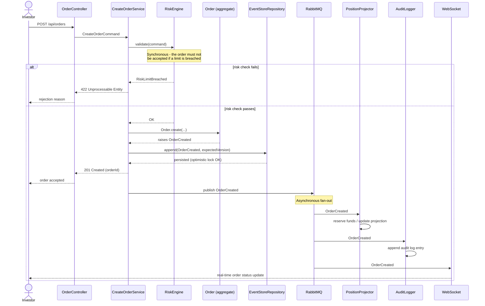

# Sequence - Order Creation

Shows the synchronous validation path (risk check must confirm immediately) followed by
the asynchronous side effects (position update, audit, notification) fired via RabbitMQ.

