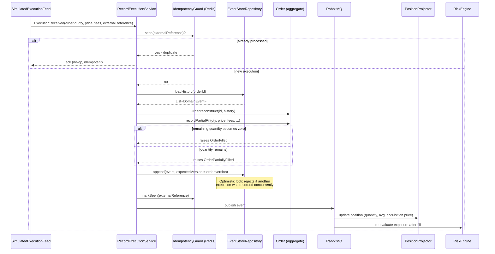

# Sequence - Partial Order Execution

Shows how a simulated external execution feed produces `TradeExecution` records, and how
the Order aggregate decides - purely from its own state - whether this fill completes the
order (`OrderFilled`) or leaves it partially filled (`OrderPartiallyFilled`).

